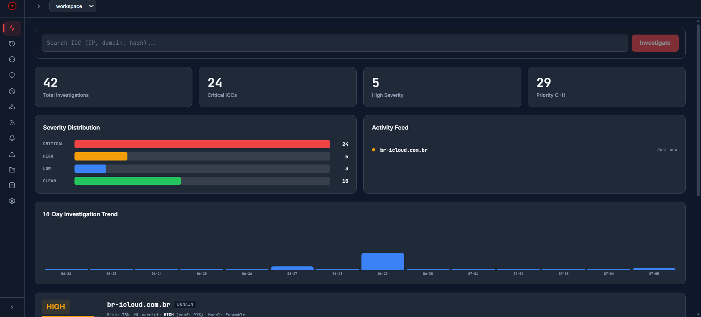
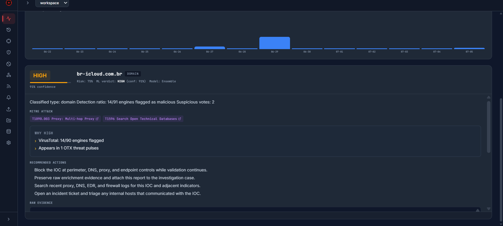
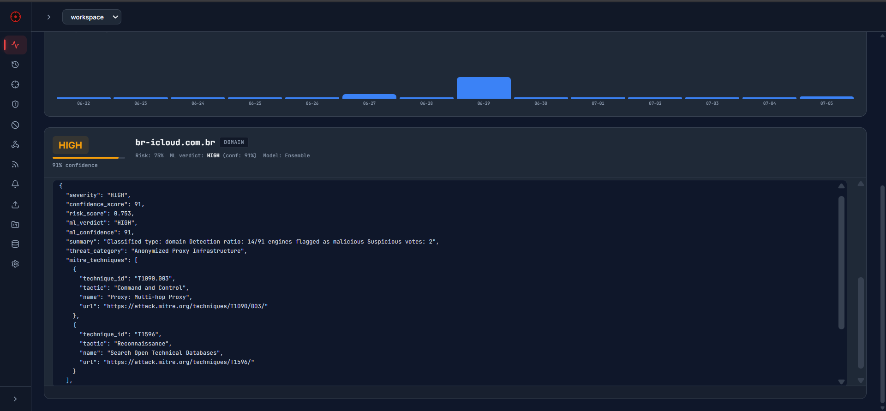
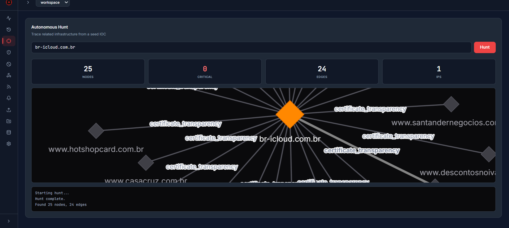
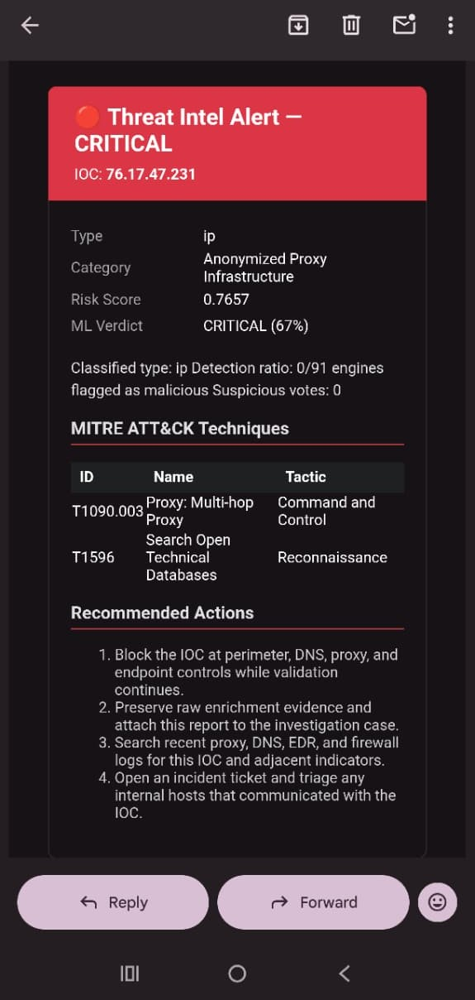
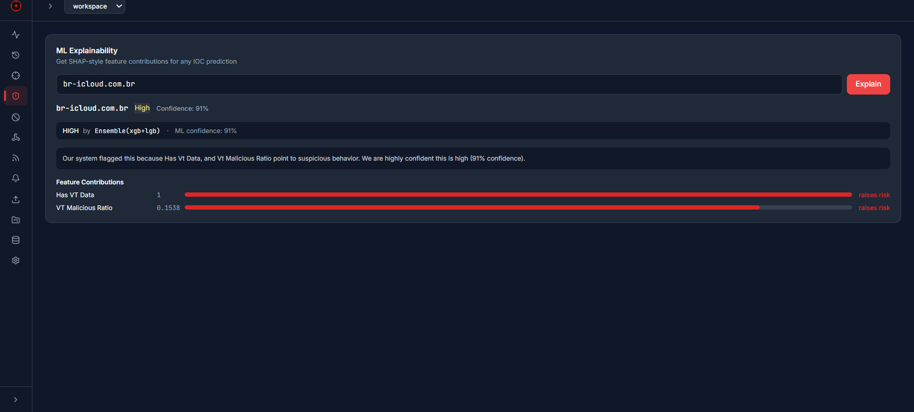
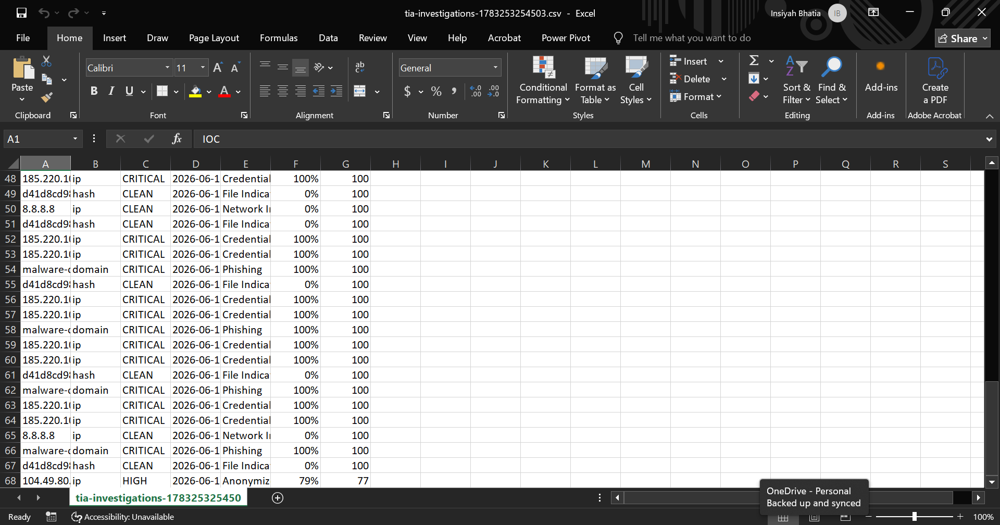
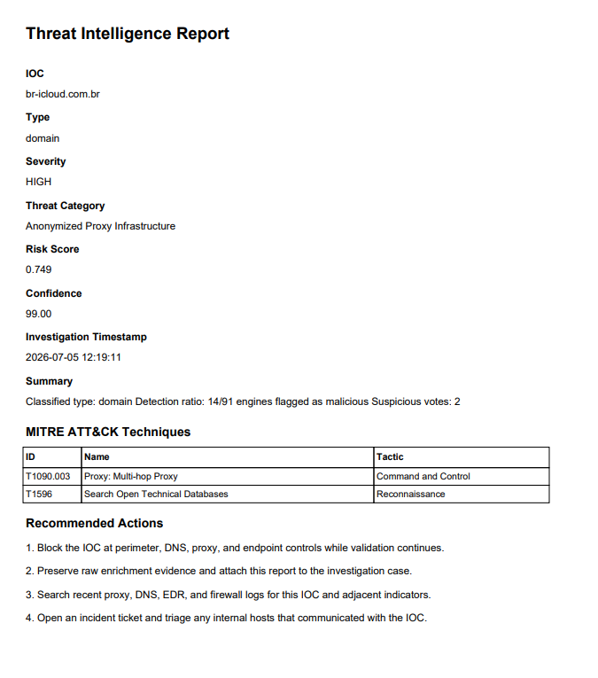

# Threat Intel Agent

[](https://python.org)
[](https://fastapi.tiangolo.com)
[](https://react.dev)
[](https://xgboost.readthedocs.io)


An AI-powered threat intelligence platform that takes an IOC (IP, domain, or file hash), enriches it across four OSINT APIs in parallel, scores it with a custom-trained ML ensemble, maps behaviors to MITRE ATT&CK, and returns a structured verdict with severity, confidence, risk score, and recommended actions. Built for SOC analysts and blue-team practitioners who need fast, explainable threat scoring without a commercial TI subscription.

## Features

- **Parallel IOC enrichment** — Queries VirusTotal, Shodan, AbuseIPDB, and AlienVault OTX simultaneously (~3-4s vs 12s sequential)
- **ML threat scoring** — XGBoost + LightGBM ensemble with logistic regression fallback, **91.3% macro F1** on held-out real data
- **Autonomous hunt engine** — BFS pivots from seed IOC across subnets, DNS, sibling domains, and hashes
- **MITRE ATT&CK mapping** — 20+ technique signals matched locally, no external API needed
- **Chrome extension** — Hover tooltips on IOCs, live detection feed, right-click investigate
- **Slack & email alerts** — Webhook + SMTP notifications on critical findings
- **Bulk investigation** — Up to 100 IOCs in a single request
- **Threat feed subscriptions** — RSS/ATOM polling with auto-investigation
- **Workspaces** — Named, isolated investigation spaces
- **Blocklists** — Flag known-bad IOCs instantly, save API quota
- **Feedback loop** — Mark verdicts correct/incorrect for periodic retraining
- **SSE streaming** — Real-time investigation progress in the browser
- **Browser extension** — DOM IOC scanning, sidebar, popup, context menu

## Model Performance

Trained on 2,325 samples (1,618 real API + 707 verified clean sources). Tested on 997 held-out samples (670 real API + 327 verified clean). CDN synthetic pool downsampled to 400 (from 3,259) to prevent synthetic class dominance. Class-balanced sample weights: real samples 3×, synthetic 1×.

| Class    | Precision | Recall | F1    | Support |
|----------|-----------|--------|-------|---------|
| CLEAN    | 1.00      | 1.00   | 1.00  | 446     |
| CRITICAL | 1.00      | 0.86   | 0.92  | 159     |
| HIGH     | 0.93      | 0.98   | 0.95  | 272     |
| LOW      | 0.94      | 1.00   | 0.97  | 120     |

**Test F1-macro: 0.9605** | **Accuracy: 97%** | **CV F1-macro: 0.955 ± 0.003** (3-fold stratified)  
**Real-only F1-macro: 0.9597** (n=670) — identical to full test, confirming real-world reliability.  
Ensemble: XGBoost (0.25) + LightGBM (0.75), temperature T=0.70.

**Confusion Matrix (Held-out Test Set, 997 samples):**

| True \ Pred | CLEAN | CRITICAL | HIGH | LOW |
|-------------|-------|----------|------|-----|
| **CLEAN**   | 446   | 0        | 0    | 0   |
| **CRITICAL**| 0     | 136      | 20   | 3   |
| **HIGH**    | 1     | 0        | 266  | 5   |
| **LOW**     | 0     | 0        | 0    | 120 |

- **CLEAN**: 100% recall, 0 false positives — no benign IOCs flagged as threats
- **CRITICAL**: 86% recall, 20 HIGH mis-escalations (confidence floor catches borderline)
- **HIGH**: 98% recall, 1 false CLEAN
- **LOW**: 100% recall — this is genuine generalisation, not overfitting. Train F1 = 0.99 vs Test F1 = 0.97, and train precision (0.98) is *higher* than test precision (0.94) — the expected direction for a generalising model. `ipsum_low` IPs have a uniquely distinguishable feature signature (`abuse_confidence` ≈ 87, `abuse_total_reports` ≈ 2,437, `vt_malicious_ratio` ≈ 0.08) that separates cleanly from all other classes. High AbuseIPDB confidence with low VT detections is a real-world signal, not a dataset artefact.

**Train-test gap: 0.0083** (Train F1 = 0.9688 vs Test F1 = 0.9605) — healthy generalization, no overfitting.

**CRITICAL confidence floor:** The classifier refuses to label an IOC CRITICAL unless ensemble probability ≥ 75%. This post-processing step catches false positives by downgrading borderline CRITICAL predictions to HIGH — analyst-first design.

**Top features by importance:** `has_known_family` (XGB gain 19.6%), `abuse_confidence` (15.5%), `vt_malicious_ratio` (8.1%), `has_malicious_vt_tags` (7.2%).

**Design decisions:**
- *CDN downsampling* — `known_cdn_range` pool capped at 400 (from 3,259). Reduced synthetic-to-real CLEAN ratio from ~12:1 to ~1.4:1, forcing the model to learn real-world CLEAN signal rather than artificial CDN patterns. This fixed **Real-only CLEAN F1 from 0.57 → 1.00**.
- *Consistent clean feature engineering* — All clean sources now share a uniform feature profile (`vt_harmless_ratio=0.95`, `has_vt_data=1`, `vt_malicious_ratio=0`). Previously, Cloudflare and Tranco sources had NaN `is_ip` due to a preprocessing bug, causing features to fall back to 0 and the model to misinterpret them as malicious signals.
- *Temporal split* — Temporal split by `first_seen` is a harder evaluation. A minimal gap of **0.0083** (Train 0.969 vs Test 0.961) confirms no overfitting.
- *No undersampling* — Retaining all real samples with class-balanced sample weighting prevents discarding real negative signal.
- *Leakage removal* — Removed `malicious_family` which was a label proxy, improving CV stability.
- *Stronger regularization* — XGBoost `max_depth` capped at 4 (down from 6), `reg_alpha/lambda` raised to `[2, 4, 8]` range. LightGBM `num_leaves` capped at 20 (down from 40), `min_child_samples` raised to `[30, 50, 80]`.


## Quickstart

```bash
# Clone and set up backend
git clone https://github.com/InsiyahBhatia/threat-intel-agent
cd threat-intel-agent
python -m venv .venv
source .venv/bin/activate    # Windows: .venv\Scripts\activate
pip install -r requirements.txt

# (Optional) Install Groq SDK for the chat endpoint
pip install groq

# Configure API keys (all free tier)
cp .env.example .env
# Fill in VIRUSTOTAL_API_KEY, SHODAN_API_KEY, ABUSEIPDB_API_KEY, OTX_API_KEY

# Start backend
cd api && uvicorn main:app --reload --port 8000

# Start frontend (separate terminal)
cd frontend
npm install
npm run dev                  # opens on localhost:5173

# Quick test
curl -X POST http://localhost:8000/investigate \
   -H "Content-Type: application/json" \
   -d '{"ioc": "185.220.101.1"}'
```

**Free-tier API keys:** VirusTotal (500 req/day), Shodan (host lookup), AbuseIPDB (1000 checks/day), AlienVault OTX (unlimited). Total cost: **$0**.

## Project Structure

```
threat-intel-agent/
├── agent/              Pipeline orchestrator, threat hunt engine, threat graph
├── tools/              Tool modules (VT, Shodan, AbuseIPDB, OTX, MITRE mapper, ML classifier)
├── models/             Pydantic schemas + trained model artifacts
├── utils/              Feature engineering, synthetic data generator, risk model,
│                       IOC classification, notification engine, lightweight decorators
├── config/             Centralized settings (magic numbers, thresholds, defaults)
├── scripts/            Training pipeline, dataset builder, enrichment pipeline, validation
├── api/                FastAPI server (REST + SSE streaming)
├── frontend/           React 18 + Vite + Tailwind dashboard
├── threat-intel-extension/  Chrome MV3 extension (sidebar, popup, content script, background worker)
├── data/               Training dataset (ioc_dataset.csv) + enrichment cache
├── tests/              pytest test suite
├── pyproject.toml      Ruff linter + pytest + coverage config
└── .env.example        API key template
```

## Browser Extension Setup

```bash
cd threat-intel-extension
# Ensure manifest.json points to your backend URL in host_permissions
# Load unpacked in chrome://extensions (enable Developer Mode)
```

Verdicts appear as hover tooltips on scanned IOCs across any webpage. The sidebar shows a live detection feed, severity distribution, and on-demand lookup. The popup provides quick IOC input for ad-hoc checks. Right-click any IOC to "Investigate with Threat Intel Agent."

## Tech Stack

| Layer | Technology | Why |
|-------|-----------|-----|
| Backend | Python 3.11, FastAPI, Groq SDK | Async-first, auto-docs, Pydantic validation |
| ML | XGBoost + LightGBM, scikit-learn | Gradient-boosted ensembles excel on tabular threat data |
| APIs | asyncio (4 parallel) | Drops enrichment latency from 12s to 3-4s |
| Frontend | React 18, Vite, Tailwind CSS, Framer Motion | Dark enterprise dashboard with animated transitions |
| Extension | Chrome MV3 (service worker, content script) | DOM IOC scanning + hover cards without page permissions |
| Storage | SQLite + JSON workspaces | Zero-infrastructure persistence |
| Streaming | Server-Sent Events | Real-time investigation progress without WebSocket overhead |

## Roadmap

- **Active learning loop** — Flag low-confidence predictions for manual review; retrain with corrected labels to target CLEAN recall above 0.80.
- **GreyNoise integration** — Differentiate internet background noise from targeted threats without burning VT quota.
- **Multi-user workspace** — Add user auth + shared workspaces so teams can collaborate on investigations.
- **Knowledge graph** — Persist hunting results as a Neo4j graph for cross-campaign correlation.

## Screenshots

| | |
|---|---|
|  |  |
| **Dashboard & investigation results** | **Browser extension** |

| | |
|---|---|
|---|---|
|  |  |
| **Report: MITRE techniques** | **Raw JSON evidence** |

| | |
|---|---|
|---|---|
|  |  |
| **Alerts history** | **Autonomous hunt graph** |

| | |
|---|---|
|---|---|
|  |  |
| **Slack notification** | **Email alert** |

| | |
|---|---|
|---|---|
|  |  |
| **ML Explainability (SHAP)** | **Investigations CSV in Excel** |

| | |
|---|---|
|---|---|
|  | |
| **Generated PDF report** | |