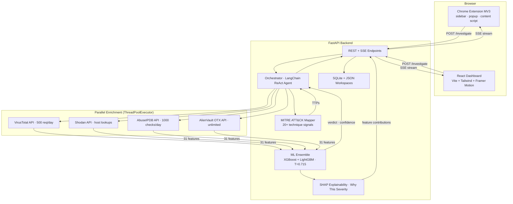
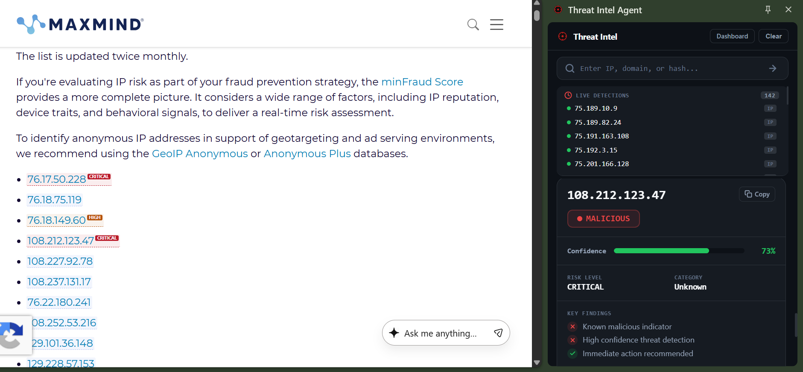
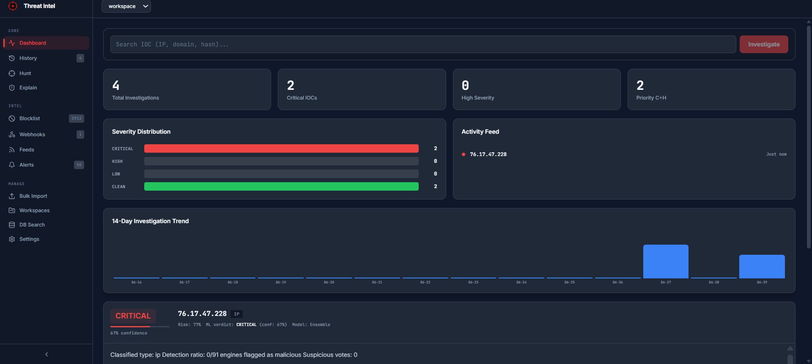
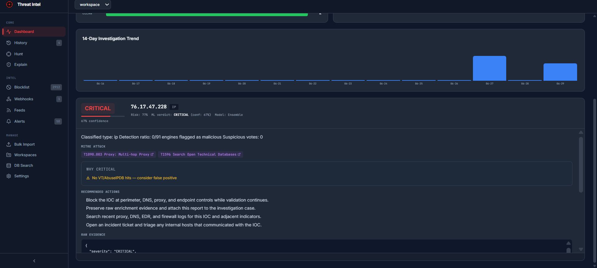
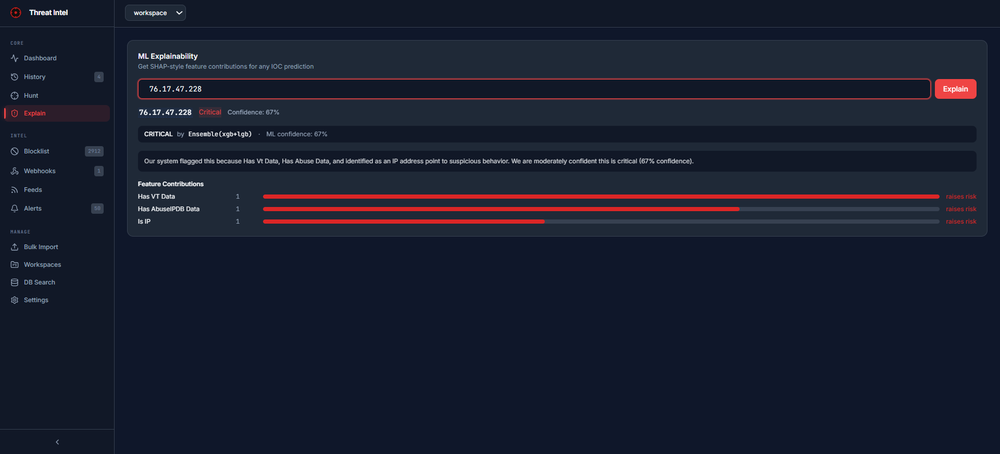
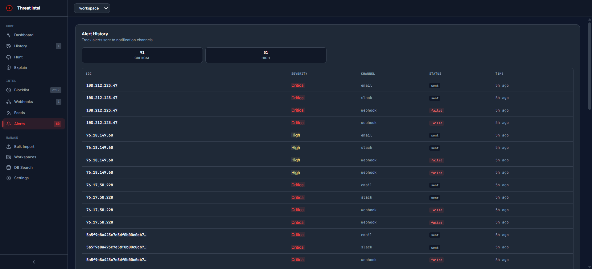
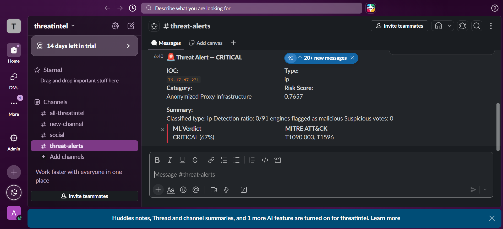
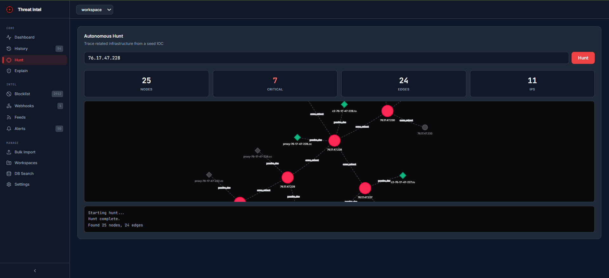

# Threat Intel Agent

[](https://python.org)
[](https://fastapi.tiangolo.com)
[](https://react.dev)
[](https://xgboost.readthedocs.io)


An AI-powered threat intelligence platform that takes an IOC (IP, domain, or file hash), enriches it across four OSINT APIs in parallel, scores it with a custom-trained ML ensemble, maps behaviors to MITRE ATT&CK, and returns a structured verdict with severity, confidence, risk score, and recommended actions. Built for SOC analysts and blue-team practitioners who need fast, explainable threat scoring without a commercial TI subscription.

## Architecture



## Features

- **Parallel enrichment** — Four APIs (VirusTotal, Shodan, AbuseIPDB, AlienVault OTX) queried simultaneously via `ThreadPoolExecutor`. Investigation latency drops from ~12s sequential to ~3-4s parallel.
- **Dual-model ML ensemble** — Primary ensemble (XGBoost + LightGBM, learned weights) for rich feature space; pure-Python logistic fallback for sparse-data edge cases (e.g., hashes with no enrichment hits). Temperature calibration (T=0.715) applied post-hoc to sharpen probability estimates.
- **31 engineered features** — Cross-source agreement signals (`vt_abuse_agreement`), derived indicators (`total_vulnerabilities`, `threat_diversity`), reputation ratios (`vt_malicious_ratio`, `vt_harmless_ratio`), and presence flags (`has_vt_data`, `has_abuse_data`, `has_shodan_data`). Missing API responses degrade gracefully (zero-filled, flagged) rather than crashing inference.
- **Autonomous threat hunt engine** — BFS pivoting from a seed IOC across related infrastructure: same /24 subnet, passive DNS co-occurrences, sibling domains, dropped hashes. Each hop enriches and scores up to 2 levels deep, returning a graph of connected infrastructure.
- **SHAP explainability** — Per-prediction feature contribution values served via `/explain/{ioc}`. Frontend renders a plain-English "Why this severity?" card reading `ml_features` to surface specific signals (VT detections, AbuseIPDB confidence, Tor node detection, CVE count, OTX pulse memberships).
- **MITRE ATT&CK mapping** — 20+ technique signals matched via keyword-to-TTP pattern matching across eight tactics (Reconnaissance through Impact). No external API dependency — runs entirely locally.
- **Slack and email alerts** — Send investigation verdicts to Slack via webhook or email via SMTP. Configurable per-channel enable/disable, tested via `/api/integrations/notifications/test`.
- **Webhook management** — Create, list, and delete custom webhook endpoints for automated alerting on investigation completion.
- **SIEM integration** — CEF-formatted alert export, MISP event push, TheHive case creation, OpenCTI push, STIX 2.1 bundle export. Each preserves the full investigation context (enrichment + model scores + MITRE mappings).
- **YARA rule generation** — Auto-generate YARA rules from investigation results or workspace IOCs via `/api/yara/generate`.
- **PDF report export** — Download investigations as formatted PDF reports for reporting or evidence preservation.
- **SSE streaming** — Server-Sent Events stream investigation progress in real time. Frontend shows per-tool status dots (queued → running → done/error), live score updates, and result popup on completion.
- **Bulk investigation** — Upload up to 100 IOCs in a single request via `/api/bulk-investigate`; processed sequentially with individual verdicts returned.
- **Threat feed subscriptions** — RSS and ATOM feed polling with configurable intervals. New IOCs from feeds auto-investigated on arrival.
- **Workspace management** — Multiple named investigation workspaces for organizing cases. Switch, create, delete workspaces via API — data isolated per workspace.
- **Blocklist management** — Add/remove/review blocklisted IOCs. Blocklisted IOCs are flagged immediately on investigation without consuming API quota.
- **Investigation feedback loop** — Mark verdicts as correct or incorrect via `/api/feedback`. Builds a human-in-the-loop correction dataset for periodic retraining.
- **Database search** — Search past investigations by IOC, severity, date range, or IOC type via `/api/db/search`. Stats endpoint for aggregate views.
- **Alert management** — View and manage triggered alerts from investigations across severity levels.
- **Syslog forwarding** — Forward structured investigation results to an external syslog server for SIEM ingestion.
- **Caching layer** — Enrichment results cached by IOC to avoid redundant API calls on repeat investigations. Cache entries expire after 24 hours.
- **Browser extension (Chrome MV3)** — DOM IOC scanning with hover tooltips, live detection feed in sidebar, popup for on-demand lookups, right-click context menu. Content script guards against SVG/XML pages (no `document.body` crash).

## Model Performance

Trained on 1,679 samples (1,479 real + 200 synthetic), tested on 635 real-only IOCs, temporally held out (earliest 80% / latest 20% by `first_seen`). No undersampling — all real samples retained with class-balanced sample weights. Dataset: 7,484 total samples (4,172 CLEAN, 1,749 HIGH, 1,163 CRITICAL, 400 LOW).

| Class    | Precision | Recall | F1   | Support |
|----------|-----------|--------|------|---------|
| CLEAN    | 0.79      | 0.69   | 0.74 | 84      |
| CRITICAL | 0.97      | 0.79   | 0.87 | 159     |
| HIGH     | 0.85      | 0.99   | 0.92 | 272     |
| LOW      | 0.97      | 0.94   | 0.96 | 120     |

**Test F1-macro: 0.8703** | **CV F1-macro: 0.8966 ± 0.0109** (3-fold stratified)

**Ensemble**: XGBoost (weight 0.64) + LightGBM (weight 0.36), temperature-calibrated (T=0.715). Ensemble weights learned via differential evolution on a held-out validation set — separate from both training and test splits.

**Design decisions:**
- *Temporal split* — Standard random splits leak future context into training (IOCs from the same campaign appear in both train and test). Temporal split by `first_seen` is a harder evaluation that reflects real deployment conditions. The ~0.03 gap between CV (random-fold) and test (temporal) metrics is expected and healthy — it shows the model generalizes beyond cross-contaminated random folds.
- *No undersampling* — Previous versions truncated CLEAN to 280 samples, discarding 60% of real CLEAN signal. Switching to `compute_sample_weight("balanced")` with all 695 real CLEAN kept gave +0.03 CLEAN F1 and +0.01 macro F1 while using 2.5x more training data.

**CLEAN recall limitation:** CLEAN recall (0.69) lags behind other classes primarily due to a data sourcing constraint — public threat intel feeds overwhelmingly carry malicious IOCs. Real CLEAN samples with non-zero enrichment features are scarce. This was partially mitigated by adding 728 Tranco top-1K domains and Cloudflare IP ranges to the training pool (of which ~80 were enriched with real API data), but most CLEAN training samples still carry zero-value enrichment fields. The model has learned that "all VT/AbuseIPDB features = 0" implies CLEAN, which makes it conservative on CLEAN samples with stray non-zero signals. Further improvement requires more diverse CLEAN samples that have non-zero but benign enrichment profiles.

## Quickstart

```bash
# Clone and set up backend
git clone https://github.com/InsiyahBhatia/threat-intel-agent
cd threat-intel-agent
python -m venv .venv
source .venv/bin/activate    # Windows: .venv\Scripts\activate
pip install -r requirements.txt

# Configure API keys (all free tier)
cp .env.example .env
# Fill in VIRUSTOTAL_API_KEY, SHODAN_API_KEY, ABUSEIPDB_API_KEY, OTX_API_KEY

# Start backend
cd api && uvicorn main:app --reload --port 8000

# Start frontend (separate terminal)
cd frontend
npm install
npm run dev                  # opens on localhost:5173

# Quick test
curl -X POST http://localhost:8000/investigate \
  -H "Content-Type: application/json" \
  -d '{"ioc": "185.220.101.1"}'
```

**Free-tier API keys:** VirusTotal (500 req/day), Shodan (host lookup), AbuseIPDB (1000 checks/day), AlienVault OTX (unlimited). Total cost: **$0**.

## Project Structure

```
threat-intel-agent/
├── agent/              LangChain orchestrator + ReAct agent loop
├── tools/              Tool modules (VT, Shodan, AbuseIPDB, OTX, MITRE mapper, ML classifier)
├── models/             Pydantic schemas + trained model artifacts
├── utils/              Feature engineering, synthetic data generator, risk model, IOC classification
├── scripts/            Training pipeline, dataset builder, enrichment pipeline, validation
├── api/                FastAPI server (REST + SSE streaming)
├── frontend/           React 18 + Vite + Tailwind dashboard
├── threat-intel-extension/  Chrome MV3 extension (sidebar, popup, content script, background worker)
├── data/               Training dataset (ioc_dataset.csv) + enrichment cache
├── tests/              pytest test suite
└── .env.example        API key template
```
## Browser Extension Setup

```bash
cd extension
# Ensure manifest.json points to your backend URL in host_permissions
# Load unpacked in chrome://extensions (enable Developer Mode)
```

Vericts appear as hover tooltips on scanned IOCs across any webpage. The sidebar shows a live detection feed, severity distribution, and on-demand lookup. The popup provides quick IOC input for ad-hoc checks. Right-click any IOC to "Investigate with Threat Intel Agent."

## Tech Stack

| Layer | Technology | Why |
|-------|-----------|-----|
| Backend | Python 3.11, FastAPI | Async-first, auto-docs, Pydantic validation |
| ML | XGBoost + LightGBM, scikit-learn, SHAP | Gradient-boosted ensembles excel on tabular threat data |
| APIs | ThreadPoolExecutor (4 parallel) | Drops enrichment latency from 12s to 3-4s |
| Frontend | React 18, Vite, Tailwind CSS, Framer Motion | Dark enterprise dashboard with animated transitions |
| Extension | Chrome MV3 (service worker, content script) | DOM IOC scanning + hover cards without page permissions |
| Storage | SQLite + JSON workspaces | Zero-infrastructure persistence |
| Streaming | Server-Sent Events | Real-time investigation progress without WebSocket overhead |
| Integration | STIX 2.1, CEF, MISP REST, TheHive API | Production SIEM/SOAR compatibility |

## Roadmap

- **Active learning loop** — Flag low-confidence predictions for manual review; retrain with corrected labels to target CLEAN recall above 0.80.
- **GreyNoise integration** — Differentiate internet background noise from targeted threats without burning VT quota.
- **Multi-user workspace** — Add user auth + shared workspaces so teams can collaborate on investigations.
- **Knowledge graph** — Persist hunting results as a Neo4j graph for cross-campaign correlation.

## Screenshots

| | |
|---|---|
|  |  |
| **Sidebar before fix** | **KPI cards & severity bars** |

| | |
|---|---|
|  |  |
| **Severity distribution** | **Hunt: Critical = 0 (bug)** |

| | |
|---|---|
|  |  |
| **Hunt: Critical = 7 (fixed)** | **Alerts with Slack/Email** |

| | |
|---|---|
|  |  |
| **Slack CRITICAL alert** | **Email alert** |
